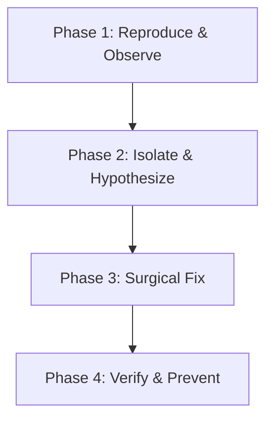

# Systematic Debugging Skill

This skill enforces a disciplined, scientific debugging process. It eliminates guesswork and "shotgun debugging" in favor of structured root-cause analysis and verifiable fixes.

---

## The 4-Phase Debugging Process

### Phase 1: Reproduce & Observe
- **Establish a minimal reproduction**: Create a simple, deterministic sequence of steps or a failing test case that consistently reproduces the symptom.
- **Gather empirical evidence**:
  - Read stack traces completely (note file paths, exact line numbers, and error classes).
  - Inspect application logs (`storage/logs/laravel.log`, browser console, network requests).
  - Check environment variables and active configurations.
- **Do not alter code yet**: Never begin changing code before understanding what is happening.

### Phase 2: Isolate & Hypothesize
- **Trace the data flow**: Follow data from user input/entry point to the point of failure.
- **Formulate specific, testable hypotheses**: "The issue occurs because condition X causes variable Y to be null at line Z."
- **Test one hypothesis at a time**: Use logging, dump statements (`dd()`, `dump()`, `console.log`), or interactive debugging to confirm or refute each assumption.
- **Binary Search / Bisect**: When diagnosing a regression across commits or large files, narrow the search space by halves.

### Phase 3: Surgical Fix
- **Target the root cause, not the symptom**: Fix the underlying flaw rather than adding band-aid null checks or suppressing exceptions.
- **Keep changes minimal**: Make the smallest necessary modification that solves the problem cleanly without collateral side effects.
- **Preserve existing contracts**: Ensure function signatures and expected return types remain consistent for callers.

### Phase 4: Verify & Prevent
- **Confirm the reproduction now passes**: Run the reproduction scenario or test case to verify that the bug is resolved.
- **Automated Regression Test**: Write a dedicated unit or feature test that specifically asserts against this bug.
- **Run the full test suite**: Verify that no existing functionality was broken by the fix.

---

## Anti-Patterns to Avoid

- **Shotgun Debugging**: Modifying random pieces of code hoping the issue disappears.
- **Premature Fixes**: Implementing a "solution" before reproducing or understanding the underlying cause.
- **Silencing Errors**: Wrapping code in empty `catch` blocks or using error-suppression operators (`@`).
- **Ignoring Edge Cases**: Testing only the happy path and neglecting null values, empty collections, or boundary limits.
