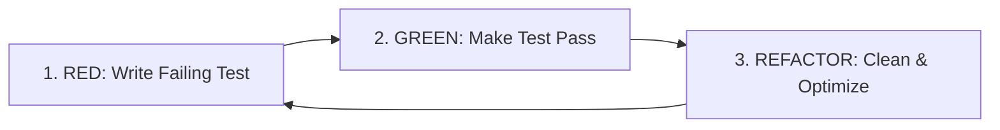

# Test-Driven Development (TDD) Skill

This skill guides the disciplined practice of Test-Driven Development (TDD) and modern automated testing. It ensures high test coverage, robust design, and regression resilience.

---

## The Red-Green-Refactor Cycle



### 1. RED (Write a Failing Test)
- Write a unit or feature test *before* writing any production code.
- Define expected behavior, inputs, and outputs from the caller's perspective.
- Run the test suite to confirm the test fails for the *expected* reason (e.g., class or method does not exist, assertion fails).

### 2. GREEN (Make the Test Pass)
- Write the minimal amount of production code needed to pass the test.
- Do not optimize or build speculative abstractions yet—focus solely on satisfying the test specification.
- Run the test to confirm it now passes.

### 3. REFACTOR (Clean and Improve)
- Clean up the code while staying green:
  - Remove duplication and magic numbers/strings.
  - Improve naming, readability, and modularity.
  - Ensure single-responsibility principles.
- Rerun tests frequently during refactoring to guarantee behavior remains intact.

---

## Test Structure: AAA Pattern (Arrange-Act-Assert)

Organize every test case with clear separation:

```php
public function test_user_can_deposit_funds_into_wallet(): void
{
    // 1. Arrange: Set up preconditions and inputs
    $user = User::factory()->create();
    $wallet = Wallet::factory()->for($user)->create(['balance' => 100]);

    // 2. Act: Perform the action under test
    $response = $this->actingAs($user)->postJson('/api/wallet/deposit', [
        'amount' => 50,
    ]);

    // 3. Assert: Verify the outcome
    $response->assertOk();
    $this->assertDatabaseHas('wallets', [
        'id' => $wallet->id,
        'balance' => 150,
    ]);
}
```

---

## Laravel Testing Conventions

- **Feature Tests** (`tests/Feature`): Test HTTP endpoints, middleware, database interactions, and controller flows.
- **Unit Tests** (`tests/Unit`): Test isolated business logic, helpers, and pure calculation methods without framework overhead.
- **Database Safety**: Use `Illuminate\Foundation\Testing\RefreshDatabase` or `DatabaseTransactions` to ensure each test runs in isolation.
- **Factories**: Always use Model Factories (`User::factory()->create()`) instead of hardcoding database seeds.
- **Mocks & Spies**: Use Laravel's built-in mocking (`Event::fake()`, `Queue::fake()`, `Http::fake()`, `Mail::fake()`) when interacting with external services.

---

## Best Practices

- **One Concept per Test**: Each test should assert one specific behavior or edge case.
- **Descriptive Names**: Name tests clearly describing the scenario and expected outcome (e.g., `user_cannot_checkout_with_empty_cart`).
- **Test Boundaries & Edge Cases**:
  - Null, zero, empty string, and boundary conditions.
  - Unauthorized and forbidden user scenarios.
  - Invalid validation payloads.
